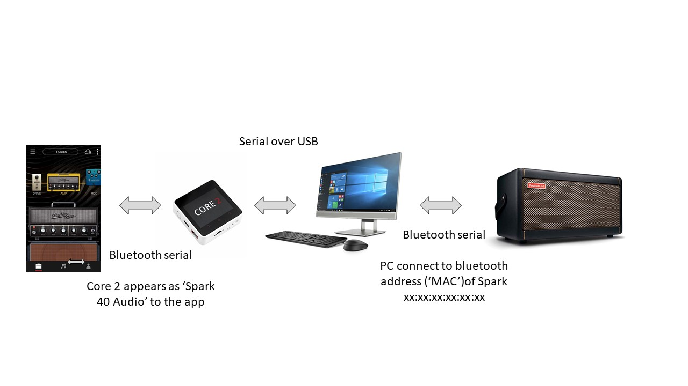

# Spark Parser Suite

This is a suite of tools to analyse and mimic the bluetooth communication between the Spark app and the Spark amp.

My set-up is as below - the M5Stack Core 2 is an ESP32 board. This appears to the app as the Spark amp and sends the bluetooth traffic to the PC as serial over USB. The PC makes a connection to the bluetooth address of the Spark amp (to avoid connecting to the Core 2 again).



I can't get it to work with a single Core connected to amp and app.

# Spark Commander 

Python functions to send commands to the Spark over bluetooth

Based on the outputs of the Spark Parser which analyses the data sent to the Spark  

This works on a Windows 10 PC running Python 3.9 - using native sockets for bluetooth (which is only in Python 3.9)  
Otherwise you need ``` pip install pybluez ``` and ```import bluetooth```.

It also needs the bluetooth address of your Spark. BluettoothCL from NirSoft will find it (on Windows).

There is a version for the Raspberry Pi 400 which will also locate the Spark from its name rather than bluetooth address.  This uses PyBluez which you need to  ```pip install pybluez```   


# Spark Preset Converter

Will take a preset in the format below and output the hex string and a python byte string.

```
preset  = { "Preset Number": [0x00, 0x7f],
            "UUID": "07079063-94A9-41B1-AB1D-02CBC5D00790",
            "Name": "Silver Ship",
            "Version": "0.7",
            "Description": "1-Clean",
            "Icon": "icon.png",
            "BPM": 120.0,
            "Pedals": [
                { "Name": "bias.noisegate",
                  "OnOff": "Off",
                  "Parameters": [0.138313, 0.224643, 0.000000] },
                { "Name": "LA2AComp",
                  "OnOff": "On",
                  "Parameters": [0.000000, 0.852394, 0.373072] },
                { "Name": "Booster",
                  "OnOff": "Off",
                  "Parameters": [0.722592] },
                { "Name": "RolandJC120",
                  "OnOff": "On",
                  "Parameters": [0.632231, 0.281820, 0.158359, 0.671320, 0.805785] },
                { "Name": "Cloner",
                  "OnOff": "On",
                  "Parameters": [0.199593, 0.000000] },
                { "Name": "VintageDelay",
                  "OnOff": "Off",
                  "Parameters": [0.378739, 0.425745, 0.419816, 1.000000] },
                { "Name": "bias.reverb",
                  "OnOff": "On",
                  "Parameters": [0.285714, 0.408354, 0.289489, 0.388317, 0.582143, 0.650000, 0.200000] }],
            "End Filler": 0xb4}


preset_hex=[
"01fe000053fead000000000000000000f0013a15010124030000007f5924003037303739303600332d393441392d00343142312d41420031442d30324342004335443030373902302b53696c7665407220536869702308302e3727312d43106c65616e286963406f6e2e706e674a3242700000172e62006961732e6e6f6940736567617465424d1300114a3e0d210d6c01114a3e66080d5102114a0000000200284c41324143186f6d704313f7",
"01fe000053fead000000000000000000f0013a1501013403010000114a003000000001114a3f305a367e02114a3e093f034b27426f6f307374657242110073114a3f387b4a2b00526f6c616e644a304331323043150033114a3f215964012b114a3e104a360223114a3e22285d0333114a3f2b5b210463114a3f4e476d2640436c6f6e6572430d1200114a3e4c620c1b01114a00000002002c56696e746100676544656c61791b421400114af7",
"01fe000053fe81000000000000000000f0013a150101300302593e416a143601114a3e597b403602114a3e56721f1603114a3f000000012b626961732e7260657665726243171600114a3e12491b5601114a3e5113475602114a3e1437673603114a3e46517c0604114a3f1507530605114a3f2666666606114a3e4c4c4d0134f7",
```


# Spark Parser

Python code to parse the data packets sent to a Spark Amp

This uses a M5Stack Core 2 ESP32 board connected to my PC via USB.
The Core 2 appears as a Spark Amp to the Spark app on an Android tablet (over bluetooth serial)
Does not work with iOS which I presume uses BLE.

All traffic to the 'amp' is captured and sent over USB as a serial stream.

The python program reads the serial input and parses it

This is a work-in-progress to interpret the commands sent to the Spark and build a picture of how packets are constructed

I also had a version with the Core 2 as the receiver from the app, connected over wi-fi to a Pi 400 to send to the amp - but couldn't get it responsive enough (buffers on bluetooth or tcp/ip, I'm not sure). It nearly worked and captured a lot of the connection sequence, but wasn't reliable.

Now considering using two Core 2s connected either via the USB to a PC or together over a serial connection of some sort  

Latest version seems to work completely and read all presets


Based on the work of Justin Nelson https://github.com/jrnelson90/tinderboxpedal and Yuriy Tsibizov https://github.com/ytsibizov/midibox

