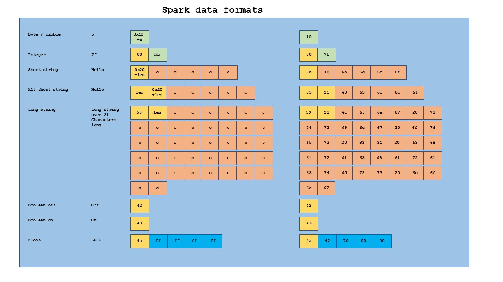
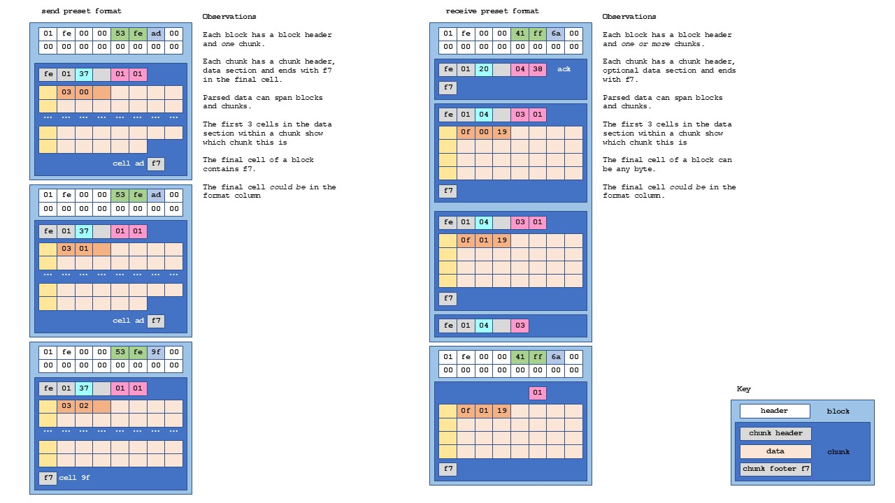
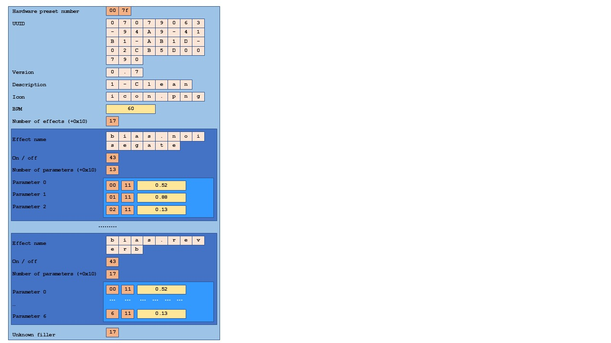

# Reverse engineering the bluetooth message format used for app to amp communications

By paulhamsh based on a description from ytsibizov.

TODO - what I still don't understand:

* What the byte 0x11 is for in each pedal preset
* Whether the nibble or byte data type really exists
* Why the chunk header sometimes contains the count of data bytes remaining (excluding format bytes) and sometimes doesn't
* What the format bytes are really used for, especially the one in front of the chunk header - it seems to have a special meaning
* What that final byte is for in the preset - a checksum? If so it isn't checked
* What the byte after the sequence byte is for

# Overview

Messages are exchanged in data blocks. The block contains one or more chunks, each chunk carrying a part of the overall message. Blocks and chunks appear to have size limits which means messages span chunks and chunks span blocks.
The pictures at the end may help visualise this.

When the app sends a message then the Spark (usually - see later) responds with an acknowledgemnent. 

The data sent to the Spark can span chunks, but each block only contains a single chunk.
So the format is block header, a chunk header, the data then the chunk trailer.
Each send block seems to have a maximum size of 0xad.
If the data spans blocks (exmample: sending a preset) then each chunk starts three bytes showing the total number of chunks and which chunk this is.

Data received from the Spark is similar but can be split over multiple blocks and multiple chunks. 
Each receive block seems to have a maximum size of 0x6a.
The first chunk is the acknowledgement (chunk header and chunk trailer, no data).

Then the following chunks are each of 32 bytes.
Each chunk starts with 3 bytes showing the number of the chunk.
There doesn't appear to be a byte showing the total number of chunks in the message.

Chunks can start in one block and end in the following block. Even the chunk header can be split.

It isn't clear why the send and receive packets are structured differently. Or why chunks span blocks.


# Data message format

### Block header
All numbers in hexadecimal

| Offset | Length | Data                                                  |
|--------|--------|-------------------------------------------------------|
|     00 |      4 | Header 01fe0000                                       |
|     04 |      2 | Direction                                             |
|     06 |      1 | Size of message (including the 6 byte header)         |
|     07 |      9 | Zeros                                                 |

### Chunk header

| Offset | Length | Data                                                  |
|--------|--------|-------------------------------------------------------|
|     10 |      2 | Fixed f001                                            |
|     12 |      1 | Sequence number                                       |
|     13 |      1 | Sequnce number follow on?????                         |
|     14 |      1 | Command                                               |
|     15 |      1 | Sub-command                                           |


### Message body
| Offset | Length | Data                                                  |
|--------|--------|-------------------------------------------------------|
|     16 |        | Message body                                          |


### Chunk trailer
| Offset | Length | Data                                                  |
|--------|--------|-------------------------------------------------------|
|     ?? |      1 | End of message f7                                     |

## Block header

### Header

| Offset | 00 | 01 | 02 | 03 |
|--------|----|----|----|----|
| Data   | 01 | fe | 00 | 00 |

### Direction 

| Offset | 04 | 05 | Description         |
|--------|----|----|---------------------|
| Data   | 41 | ff | Received from Spark |
| Data   | 53 | fe | Sent to Spark       |

### Size of message

| Offset | 06     | Description                |
|--------|--------|----------------------------|
| Data   | length | Number of bytes in message |

### Zeros

| Offset | 07 | 08 | 09 | 0A | 0B | 0C | 0D | 0E | 0F |
|--------|----|----|----|----|----|----|----|----|----|
| Data   | 00 | 00 | 00 | 00 | 00 | 00 | 00 | 00 | 00 |

## Chunk header

### Fixed

| Offset | 10 | 11 |
|--------|----|----|
| Data   | f0 | 01 |

### Sequence number

This remains the same for a multi-packet message.   
It is also used in the acknowledgement message.   

| Offset |  12              |  
|--------|------------------|
| Data   |  sequence number |

### Unkown

| Offset |  13                           |  
|--------|-------------------------------|
| Data   |  unknown                      |

It is known (from the existing working code) that this number is never checked by the amp.

### Command and sub-command

The command is also used in the acknowledgement message.  

| Offset |  14       |  15         |
|--------|-----------|-------------|
| Data   | command   | sub-command |

This is then followed by the message body (see below)  

### Multi-chunk messages and the multi-chunk inner header

A message can be carried over multiple chunks. In this case each new chunk starts an inner header - the format byte, then three additional bytes as below.

| Name   | 1           | 2                  | 3                           | 4                               |
|--------|-------------|--------------------|-----------------------------|---------------------------------|
| Data   | Format byte |  Number of chunks  |  This chunk (0 - number-1)  |  Number of data bytes remaining |

The number of data bytes remaining is a count of bytes excluding the format bytes, and whilst always in the final chunk seems not to be in prior chunks when sending to the Spark.  
The Format byte seems to have a special difference in this scenario, and has bit 3 (| 0x04) set for the all the chunks except the last, where is seems to have bit 3 empty (& 0xfb) but may have bit 4 set (| 0x08). This implies this bit can be used to determine the final chunk although it is not required for that. Having bit 3 set is inconsistent with the use of the format byte as it indicates data starting in byte 4, which is still part of this inner header 


### Trailer

| Offset | xx |
|--------|----|
| Data   | f7 |


## Message body

The body of the message made of sequences of 8 bytes - 1 format byte and then 7 bytes of data. 
Arguments are sequential in the data sequence and the format byte shows where new a new argument starts.
Each bit maps to a byte in the next sequence, and if the bit is set in the format byte then that byte in the sequence is the start of a new data element.
Strings have their length as their first byte (stored as 0x20 + length).

An example is shown below, with each new data sequence on a new line. The bit expansion is the format byte with the bits reversed, to show where the new sequence starts.

Exploring the data it doesn't look like the format bits are always correct.  But they are used by the Spark - if they are set to zero then the message doesn't work. Perhaps it uses them to find the start of a data element only and ignores any that imply another element starts within it.  

It seems that each command / sub-command has a specific set of parameters and these bits are not required to fully interpret the message (even though Spark appears to use them). 

```
     F1   D1 D2 D3 D4   D5 D6 D7               Reversed bit expansion of F1
     02   xx                                   0100 000x
             2b 52 6f   79 61 62 x
     40   20 43 72 6f   77 6e                  0000 001x
                              23 
     08   30 2e 37                             0001 000x
                   27   31 2d 43 
     10   6c 65 61 6e                          0000 100x
                        28 69 63
     40   6f 63 2e 70   6e 67                  0000 001x
                              4a 
     32   42                                   0100 110x 
             70 00 00   
                        17 
                           2e 62        
     00   69 61 73 2e   6e 6f 69               0000 000x
     40   73 65 67 61   74 65                  0000 001x
                                 xx
```

Which translates to:  

```
     String: Royal Crown   
     String: 0.7  
     String: 1-Clean  
     String: icon.png  
     Float:  42 70 00 00  
     Byte:   17  
     String: .bias.noisegate  
```

It appears that strings are the only variable length data sequence and the only sequence that starts with a length

### Data types

| Type                             |   Length |  Example                                | Description                                                  |
|----------------------------------|----------|-----------------------------------------|--------------------------------------------------------------|
| Byte  (or just a nibble?)        |        1 | 0x10 - 0x1f                             | Subtract 0x10 from byte to get the value                     | 
| Integer number, big endian ??    |        2 | 0000 - ffff                             | Not sure this exists or perhaps it is 00 then a byte         |
| Short string                     | 1 + 1-31 | 0x20 - 0x3f                             | Length + 0x20, bytes of string                               |
| Very short sting                 | 2 + 1-15 | 0x01 - 0x0f, 0x20 - 0x2f, bytes         | Length, length + 0x20, bytes of string                       |
| Long string                      |  2 + 32+ | 0x59, length, bytes of string           | 0x59, length, bytes of string                                |
| Boolean "True"                   |        1 | 0x42                                    | Pedal Off                                                    |
| Boolean "False"                  |        1 | 0x43                                    | Pedal on                                                     |
| Float                            |    4 + 1 | 0x4a + 4 bytes of floating point        |                                                              |





## Commands

| Value | Command         |
|-------|-----------------|
|  01   | Set on Spark    |
|  02   | Get from Spark  | 
|  03   | Spark update    |
|  04   | Ack             |


## SET command

Following SET operations are known:

| Sub-command | Description            | Arguments
|-------------|------------------------|-----------------------------------------------------------
| 01          | Send preset            | *UUID*, preset name, version, description, *float*, *byte*, noisegate name, boolean, ?,?, float, 
| 04          | Change parameter       | String: pedal name, Byte: parameter reference, Float: new value
| 06          | Change pedal           | String: old pedal name, String: new pedal name
| 15          | Enable/disable a pedal | String: pedal name, Boolean: on/off
| 38          | Change to preset       | Int: preset number (0 - 3)

### 01 Send preset 

A new preset is a multi-packet message.   
Each packet starts with two bytes for the total number of packets and which packet this is.  
Each packet also has the same sequence number in the header.   

| Type     | Length | Content                                                                     |
|----------|--------|-----------------------------------------------------------------------------|
|  Byte    |      1 | Number of packets in total (1- )                                            |
|  Byte    |      1 | Reference for this packet (0- )                                             |
|  Byte    |      1 | NUmber of bytes of data if this is the last packet (excludes format bytes)  |

Followed by:

| Type     | Length | Content                                               |
|----------|--------|-------------------------------------------------------|
|  Byte    |      1 | 00                                                    |
|  Byte    |      1 | 7f - probably the hardware preset location            |
|  UUID    |     36 | UUID for preset                                       |
|  String  |      x | Preset name                                           |
|  String  |      x | Version                                               |
|  String  |      x | Preset description                                    |
|  String  |      x | Icon name                                             |
|  Float   |      4 | BPM (seems to be 60.0)                                |
|  Byte    |      1 | Number of pedals in preset                            |

Followed by information for each pedal / amp:

| Type     | Length | Content                                               |
|----------|--------|-------------------------------------------------------|
|  String  |      x | Pedal name                                            |
|  Boolean |      1 | On/off                                                |
|  Byte    |      1 | Number of parameters following (+0x10)                |

Each pedal header is followed by values for each pedal parameter:

| Type     | Length | Content                                               |
|----------|--------|-------------------------------------------------------|
|  Byte    |      1 | Parameter reference (starts at 0)                     |
|  Byte    |      1 | 11 ??                                                 |
|  Float   |      4 | Parameter value                                       |
|          |        |                                                       |
|  Byte    |      1 | Parameter reference (starts at 0)                     |
|  Byte    |      1 | 11 ??                                                 |
|  Float   |      4 | Parameter value                                       |
|          |        |                                                       |
|   ...    |    ... | ...                                                   |
 
### 04 Change parameter (the value of a switch / dial on a pedal) 

Arguments are a string for the pedal name, a byte for which parameter is being altered (starting at 0) and a float for the new value.

Floats representing values from 0 to 10.0 are stored as 0.0 to 1.0 (divide by ten)

| Type     | Length | Content                                               |
|----------|--------|-------------------------------------------------------|
|  Byte    |      1 | (String length ??)                                    |
|  String  |      x | Pedal name                                            |
|  Byte    |      1 | Parameter reference                                   |
|  Float   |      4 | Parameter value (0.xx represents x.x in the app)      |

### 06 Swap pedals

Arguments are a string for the current pedal name, and string for new pedal name.

| Type     | Length | Content                                               |
|----------|--------|-------------------------------------------------------|
|  Byte    |      1 | (String length ??)                                    |
|  String  |      x | Old pedal name                                        |
|  Byte    |      1 | (String length ??)                                    |
|  Float   |      4 | New pedal name                                        |

### 15 Enable/disable a pedal sub-command

| Type     | Length | Content                                               |
|----------|--------|-------------------------------------------------------|
|  Byte    |      1 | (String length??)                                     |
|  String  |      x | Pedal name                                            |
|  Boolean |      1 | Pedal on / off                                        |

On is 0x43, Off is 0x42.

### 38 Change preset 

Only argument is an integer for which preset to select (0-3)

| Type     | Length | Content                                               |
|----------|--------|-------------------------------------------------------|
|  Integer |      2 | Preset reference (0-3)                                |

## GET Command

Following GET operations are known:

| Sub-command |                          |
|-------------|--------------------------|
|  01         | Get preset configuration |
|  11         | Get device name          |
|  23         | Get serial number        |
|  24         | ???                      |

### 01 Get preset configuration

Multiple arguments, only first one is actually used

 - Integer number - Preset number starting 0x0000 to 0x0003, or 0x0100 for "current"
 - 34 times "0x00" 


## UPDATED Command

Following UPDATED operations are known:

| Sub-command | Description              |
|-------------|--------------------------|
|  06         | Pedal changed on Spark   |
|  37         | Changed value on Spark   |
|  38         | Preset changed on Spark  |

## ACK packet

After (most) successful operations, amp sends back an "ack" packet.
This has the command 0x04, the same sequence number as the original packet and a sub-command the same as the sub-command sent to the Spark

The operations that receive an ACK are:
* Turn pedal on/off
* Change pedal / amp
* Change hardware preset

The operations that do not receive an ACK are:
* Change pedal parameter 

# Pedal and amp names

## Noisegate

| App name               | Spark internal name         |
|------------------------|-----------------------------|
| Noisegate              | bias.noisegate              |


## Compressors

| App name               | Spark internal name         |
|------------------------|-----------------------------|
| LA Comp			     | LA2AComp                    |
| Sustain Comp		     | BlueComp                    |
| Red Comp		     | Compressor                  |
| Bass Comp		     | BassComp                    |
| Optical Comp		     | BBEOpticalComp              |

## Drive

| App name               | Spark internal name         |
|------------------------|-----------------------------|
| Booster			     | Booster                     |
| Tube Drive		     | DistortionTS9               |
| Over Drive		     | Overdrive                   |
| Fuzz Face		     | Fuzz                        |
| Black Op		     | ProCoRat                    |
| Bass Muff		     | BassBigMuff                 |
| Guitar Muff		     | GuitarMuff                  |
| Bassmaster		     | MaestroBassmaster           |
| SAB Driver		     | SABdriver                   |

## Amps

| App name               | Spark internal name         |
|------------------------|-----------------------------|
| Silver 120             | RolandJC120                 |
| Black Duo    		| Twin                        |
| AD Clean		     | ADClean                     |
| Match DC		     | 94MatchDCV2                 |
| Tweed Bass		     | Bassman                     |
| AC Boost		     | AC Boost                    |
| Checkmate		     | Checkmate                   |
| Two Stone SP50		| TwoStoneSP50                |
| American Deluxe		| Deluxe65                    |
| Plexiglass		     | Plexi                       |
| JM45			     | OverDrivenJM45              |
| Lux Verb		     | OverDrivenLuxVerb           |
| RB 101			     | Bogner                      |
| British 30		     | OrangeAD30                  |
| American High Gain	| AmericanHighGain            |
| SLO 100			     | SLO100                      |
| YJM100			     | YJM100                      |
| Treadplate		     | Rectifier                   |
| Insane			     | EVH                         |
| Switch Axe		     | SwitchAxeLead               |
| Rocker V		     | Invader                     |
| BE 101			     | BE101                       |
| Pure Acoustic		| Acoustic                    |
| Fishboy			     | AcousticAmpV2               |
| Jumbo			     | FatAcousticV2               |
| Flat Acoustic		| FlatAcoustic                |
| RB-800			     | GK800                       |
| Sunny 3000		     | Sunny3000                   |
| W600			     | W600                        |
| Hammer 500		     | Hammer500                   |

## Modulation

| App name               | Spark internal name         |
|------------------------|-----------------------------|
| Tremolo			     | Tremolo                     |
| Chorus			     | ChorusAnalog                |
| Flanger			     | Flanger                     |
| Phaser			     | Phaser                      |
| Vibrato			     | Vibrato01                   |
| UniVibe			     | UniVibe                     |
| Cloner Chorus		| Cloner                      |
| Classic Vibe		     | MiniVibe                    |
| Tremolator		     | Tremolator                  |
| Tremolo Square		| TremoloSquare               |

## Delay

| App name               | Spark internal name         |
|------------------------|-----------------------------|
| Digital Delay		| DelayMono                   |
| Echo Filt		     | DelayEchoFilt               |
| Vintage Delay		| VintageDelay                |
| Reverse Delay		| DelayReverse                |
| Multi Head		     | DelayMultiHead              |
| Echo Tape              | DelayRe201                  |

## Reverb

| App name               | Spark internal name         |
|------------------------|-----------------------------|
| All Reverbs		     | bias.reverb                 |z


# Connect messages

These are the messages sent when the app connects to the Spark amp.
Partial list so far

| Direction   | Command  | Sub-command  |  Operation               | Description
|-------------|----------|--------------|--------------------------|------------------------------------
| To Spark    | 02       | 11           | Get amp name             |             
| From Spark  | 03       | 11           |                          | Byte: 08 String: Spark 40
| To Spark    | 02       | 24           | ??????                   | Bytes: 14,0,1,2,3
| To Spark    | 02       | 23           | Get serial number        | 
| From Spark  | 03       | 23           |                          | D, String: Serial number with 'w' at end
| To Spark    | 02       | 01           | Get preset configuration | Lots of 00
| From Spark  | 03       | 01           |                          | 

## Preset data format (byte layout)

Shows the multi-block byte-level information for a preset



## Preset format (logical)

Logical view of the data encoded in the preset



## Non-preset data format

Shows the single block byte-level information for other commands (not preset send)


